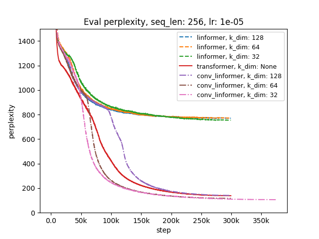
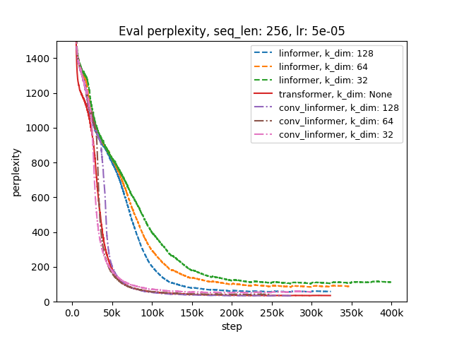
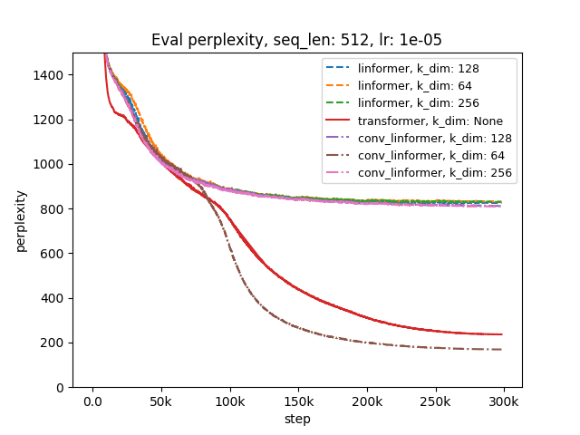
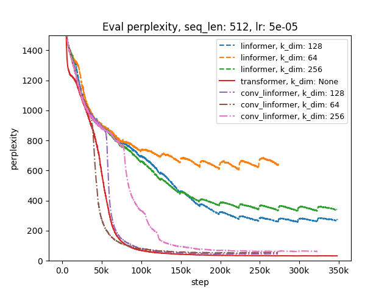

# Conv-Linformer: Boosting Linformer’s Performance with Convolution in Small-Scale Settings

This repository contains the code and experiments from my application to the **Eastern European Machine Learning (EEML) Summer School**. The project involves:

1. A **systematic study** of Linformer’s behavior under resource constraints.
2. A proposed variant — **Conv-Linformer** — aimed at improving training stability and performance in these settings.

---

## 🧠 Motivation

The [Linformer](https://arxiv.org/abs/2006.04768) reduces the quadratic complexity of self-attention by leveraging low-rank projections of keys and values. While efficient at scale, its performance in **resource-constrained environments** (e.g., limited data, constrained compute) remains underexplored.

This project investigates:
- How Linformer behaves in such settings.
- Whether simple architectural tweaks can improve its robustness and effectiveness.

---

## 🔬 Linformer: Understanding the Core Mechanism

Linformer’s core innovation is **low-rank approximation** of the self-attention mechanism to reduce its time and memory complexity. Traditional self-attention requires quadratic time complexity $O(n^2)$, where $n$ is the sequence length. Linformer reduces this complexity to linear $O(nk)$, where $k$ is a smaller constant representing the approximation dimension.

Key elements of Linformer's mechanism:
1. **Low-Rank Projections**: Instead of computing the attention across the entire sequence, Linformer approximates the key and value matrices by using **learnable projections**. This reduces the sequence length to a fixed smaller value.
2. **Global Context**: The projection ensures that long-range dependencies are maintained, making it computationally efficient without significant information loss.

### Linformer Attention Equation:

$$
\text{Attention}(Q, K, V) = \text{softmax}\left( \frac{Q (E K)^T}{\sqrt{d_k}} \right) \cdot (F V)
$$

Where:
- $E$ and $F$ are low-rank projection matrices that reduce $K$ and $V$ from $n$ to $k$, enabling linear complexity.

---

## 📊 Part 1: Reproducing Linformer

### Experimental Setup:
- **Dataset**: [WikiText-103](https://huggingface.co/datasets/Salesforce/wikitext), subset to 50M tokens.
- **Sequence lengths**: 128, 256, 512, 1024.
- **Model**: Encoder-only Transformer with 8 layers, hidden size 512, and 8 attention heads.
- **Training**: MLM objective, Hugging Face `Trainer`, AdamW optimizer with 10% warmup and weight decay (0.001).

### Key Insights:
- **Short sequences** perform well, but **longer sequences** suffer from instability at high learning rates.
- Lower learning rates stabilize training, but may lead to slower convergence or cause the model to get stuck in a local minimum.
- The performance degradation seems tied to Linformer’s **low-rank projections**, which struggle to learn key patterns in data-scarce settings.

---

## 🚀 Part 2: Introducing Conv-Linformer

To overcome the limitations of Linformer, I introduce **Conv-Linformer**, a hybrid architecture that combines the best of both worlds:

- **Linear projections** in the early layers to retain global context efficiently.
- **1D convolution** in the later layers to capture local patterns.

This design allows Conv-Linformer to combine the benefits of Linformer’s efficient global context modeling with convolution’s ability to capture fine-grained local structures.

### Conv-Linformer Equation:

$$
\text{Attention}(Q, K, V) = \text{softmax}\left( \frac{Q (F_k * K)^T}{\sqrt{d_k}} \right) \cdot (F_v * V)
$$

Where:
- $F_k$ and $F_v$ are convolutional kernels applied to the key and value matrices with kernel size and stride $n/k$, preserving linear complexity while enhancing local feature extraction.

### Key Benefits:
- **Improved training stability** across sequence lengths.
- **More consistent performance** than Linformer in constrained settings.
- **Transformer-level performance**, with linear complexity and minimal overhead from convolution.

---

## 📈 Results

### 🔍 Performance Across Sequence Lengths

Below are validation perplexity curves for Transformer, Linformer and Conv-Linformer across different sequence lengths:

  
   
  
  

- Conv-Linformer maintains more stable training and performs on par with Transormer.
- Linformer's performance degrades more gradually with increasing sequence length and learning rate.

### ⚡ Inference Time Analysis

We compare the average inference time per batch for each model across different sequence lengths:

| Sequence Length  | Linformer (ms) | Conv-Linformer (ms)  | Transformer (ms)|
|------------------|----------------|----------------------|-----------------|
| 128              | *TBD*          | *TBD*                | *TBD*           |
| 256              | *TBD*          | *TBD*                | *TBD*           |
| 512              | *TBD*          | *TBD*                | *TBD*           |
| 1024             | *TBD*          | *TBD*                | *TBD*           |
| 2048             | *TBD*          | *TBD*                | *TBD*           |
| 4096             | *TBD*          | *TBD*                | *TBD*           |

**Key observations:**
- Conv-Linformer introduces **minimal overhead**.
- Time scales linearly with sequence length for both Linformer and Conv-Linformer.

---

## 🔗 References

- 📄 [Linformer: Self-Attention with Linear Complexity](https://arxiv.org/abs/2006.04768)  
- 🔗 [lucidrains/linformer](https://github.com/lucidrains/linformer)  
- 📚 [Salesforce/wikitext](https://huggingface.co/datasets/Salesforce/wikitext)

---

## 🌱 Future Work

- Scale experiments to larger datasets and tasks.
- Investigate additional compression strategies.
- Evaluate performance on downstream NLP benchmarks.

